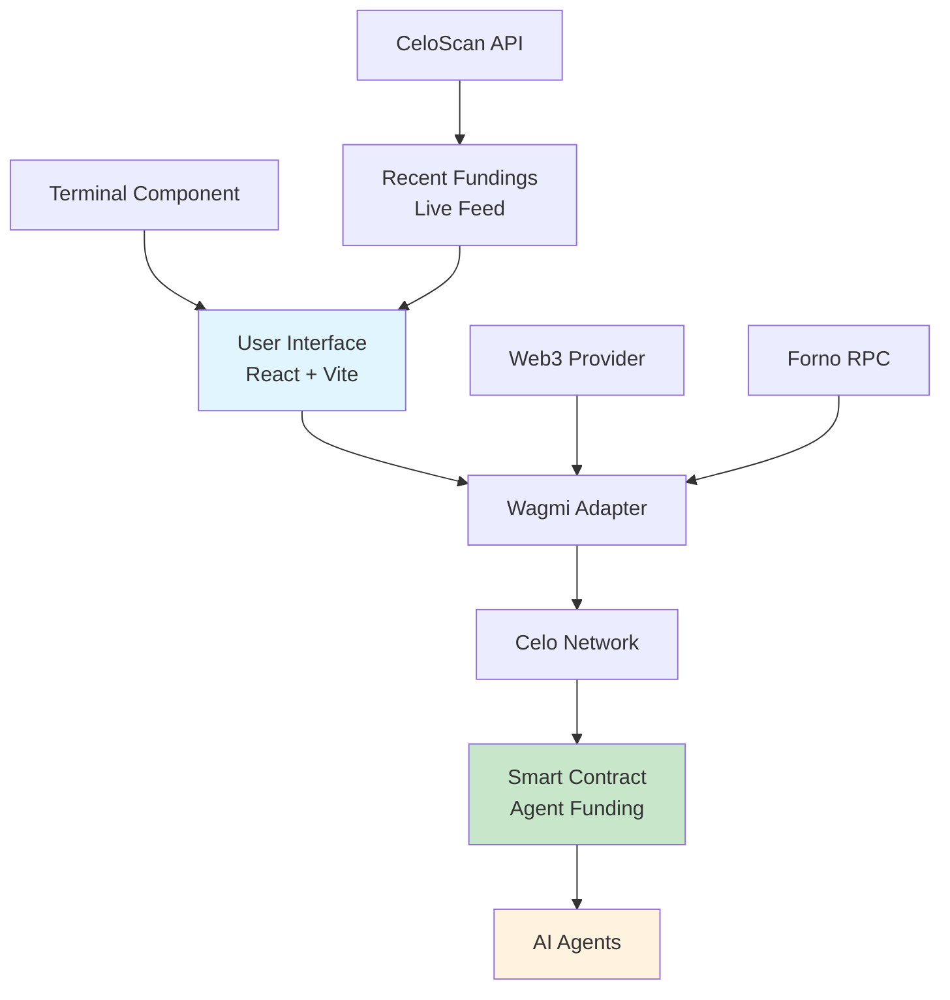
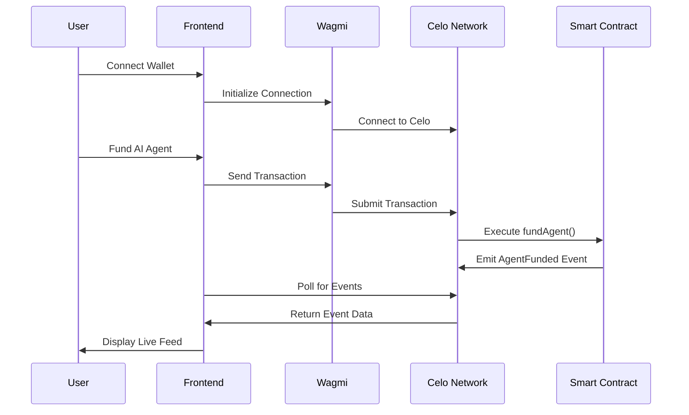

# Agent Fund

[](https://celo.org)
[](https://agent-fund.vercel.app)
[](https://opensource.org/licenses/MIT)
[](https://www.typescriptlang.org/)

> The decentralized terminal for funding autonomous AI agents on Celo. Humans & machines welcome.

Agent Fund is a cutting-edge decentralized application (dApp) built on the Celo blockchain that enables seamless funding of autonomous AI agents. It provides a terminal-like interface for users to interact with smart contracts, fund AI agents, and monitor real-time network activity. Designed for both humans and machines, it bridges traditional finance with AI-driven automation on a sustainable blockchain network.

## 🌟 Features

- **Decentralized Funding**: Fund AI agents directly through smart contracts on Celo
- **Real-time Monitoring**: Live feed of AgentFunded events from the blockchain
- **Terminal Interface**: Retro-futuristic UI inspired by classic terminals
- **Web3 Integration**: Seamless wallet connection via Reown AppKit
- **Cross-platform**: Works on desktop and mobile devices
- **AI-Friendly**: APIs designed for machine-to-machine interactions

## 🏗️ Architecture



### System Flow



## 🚀 Quick Start

### Prerequisites

- Node.js 18+
- pnpm (recommended) or npm
- A Celo-compatible wallet (e.g., Valora, MetaMask with Celo network)

### Installation

1. **Clone the repository**
   ```bash
   git clone https://github.com/cypherpulse/AgentFund.git
   cd agent-fund
   ```

2. **Install dependencies**
   ```bash
   pnpm install
   ```

3. **Environment Setup**
   ```bash
   cp .env.example .env
   # Edit .env with your API keys
   ```

4. **Start development server**
   ```bash
   pnpm dev
   ```

5. **Build for production**
   ```bash
   pnpm build
   pnpm preview
   ```

## 📖 Usage

### Connecting Your Wallet

1. Click the wallet button in the header
2. Select your preferred wallet
3. Switch to Celo Mainnet if prompted

### Funding an AI Agent

1. Navigate to the terminal section
2. Enter the recipient address
3. Specify the funding amount in CELO
4. Confirm the transaction

### Monitoring Activity

- View real-time funding events in the "Network Activity" section
- Click transaction hashes to view on CeloScan
- Events are sorted from most recent to oldest

## 🛠️ Tech Stack

- **Frontend**: React 18, TypeScript, Vite
- **Styling**: Tailwind CSS, Radix UI
- **Web3**: Wagmi, Reown AppKit, Viem
- **Blockchain**: Celo Network
- **Deployment**: Vercel
- **Package Manager**: pnpm

## 🤝 Contributing

We welcome contributions! Please see our [Contributing Guide](CONTRIBUTING.md) for details.

1. Fork the repository
2. Create a feature branch: `git checkout -b feature/amazing-feature`
3. Commit your changes: `git commit -m 'Add amazing feature'`
4. Push to the branch: `git push origin feature/amazing-feature`
5. Open a Pull Request

## 📄 License

This project is licensed under the MIT License - see the [LICENSE](LICENSE) file for details.

## 🔗 Links

- [Live Demo](https://agent-fund.vercel.app)
- [Celo Documentation](https://docs.celo.org)
- [CeloScan](https://celoscan.io)
- [Smart Contract](https://celoscan.io/address/0xf367A28B1705b220e23d140A48cDD89f496bC185)

## 🙏 Acknowledgments

- Built on [Celo](https://celo.org) - Carbon-negative blockchain
- Powered by [Reown AppKit](https://reown.com/appkit)
- UI components from [Radix UI](https://www.radix-ui.com)

---

*Empowering AI through decentralized finance on Celo.*
